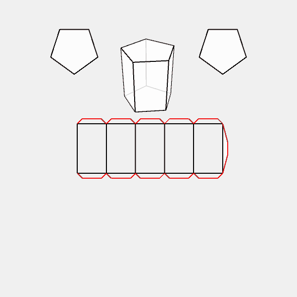

# Paper objects with Processing and Python

> Studies in digital fabrication

You will need to [install Processing Python Mode](https://abav.lugaralgum.com/como-instalar-o-processing-modo-python/index-EN.html) to run these examples!

---

[simple_2D_unfolded_box](simple_2D_unfolded_box)

---

[box_with_rectangular_holes](box_with_rectangular_holes/)

---

[box_with_circular_holes](box_with_circular_holes/)

---

[paraboloid_box_v0](paraboloid_box_v0/)

---

[unfold_pyramid](unfold_pyramid/)

---

[unfold_pyramidal_solid](unfold_pyramidal_solid/)

