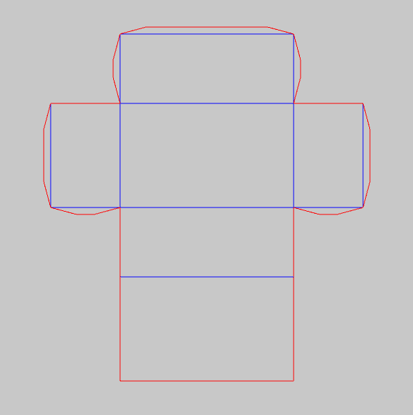
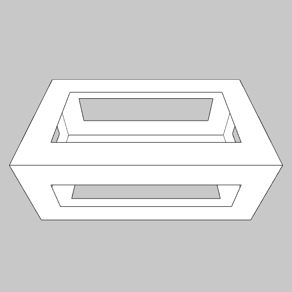
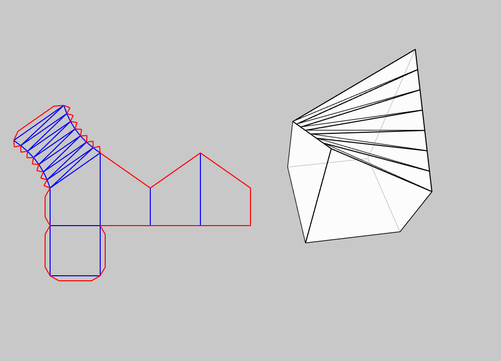
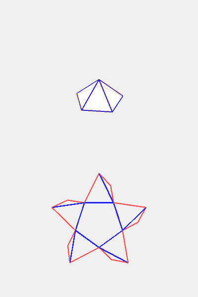

# Paper objects with Processing and Python

<h1 id="toc"></h1>

Studies in digital fabrication [from this GitHub repository](https://github.com/villares/Paper-objects-with-Processing-and-Python/) using the [py5](https://py5coding.org) library that combines the Processing drawing infrastructure with modern Python. More about [installing py5 and using the imported mode style](https://abav.lugaralgum.com/como-instalar-py5/index-EN.html).

For the earlier [Processing Python Mode](https://abav.lugaralgum.com/como-instalar-o-processing-modo-python/index-EN.html) version of this project, visit the ["archived branch"](https://github.com/villares/Paper-objects-with-Processing-and-Python/tree/Processing-Python-mode).

<!--  -->

## Simple 2D unfolded box

[Code for the Simple 2D unfolded box](https://github.com/villares/Paper-objects-with-Processing-and-Python/tree/main/simple_2D_unfolded_box/)

## Box with rectangular holes

[Code for Box with rectangular holes](https://github.com/villares/Paper-objects-with-Processing-and-Python/tree/main/box_with_rectangular_holes/) 

## Box with cricular holes

[Code for Box with circular holes](https://github.com/villares/Paper-objects-with-Processing-and-Python/tree/main/box_with_circular_holes/) 

## Paraboloid box

[Code for Paraboloid box v0](https://github.com/villares/Paper-objects-with-Processing-and-Python/tree/main/paraboloid_box_v0/)

## Unfold Pyramid

[Code for Unfold pyramid](https://github.com/villares/Paper-objects-with-Processing-and-Python/tree/main/unfold_pyramid/)

## Unfold Pyramidal Solid

[Code for Unfold pyramidal solid](https://github.com/villares/Paper-objects-with-Processing-and-Python/tree/main/unfold_pyramidal_solid_py5/) 

