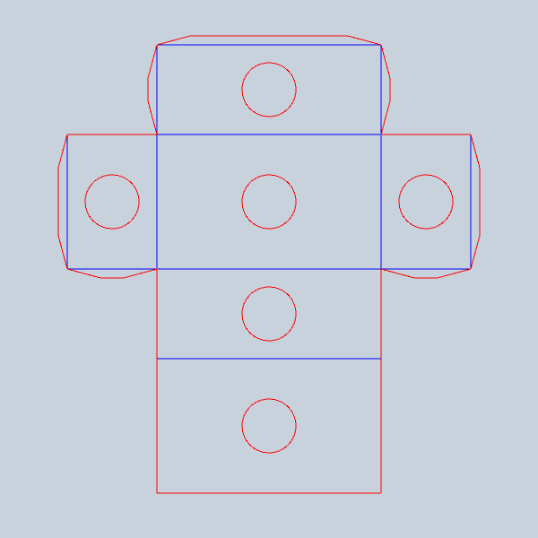

# Paper objects with Processing and Python

> Studies in digital fabrication

This is work in progress to convert the materials to [py5](https://py5coding.org). For the earlier [Processing Python Mode](https://abav.lugaralgum.com/como-instalar-o-processing-modo-python/index-EN.html) code, visit the "archive" branch: https://github.com/villares/Paper-objects-with-Processing-and-Python/tree/Processing-Python-mode

---

[simple_2D_unfolded_box](simple_2D_unfolded_box/)

<!--  WIP

---

[box_with_rectangular_holes](box_with_rectangular_holes/)

---

[box_with_circular_holes](box_with_circular_holes/)

---

[paraboloid_box_v0](paraboloid_box_v0/)

---

[unfold_pyramid](unfold_pyramid/)

-->

---

[unfold_pyramidal_solid](unfold_pyramidal_solid_py5/)